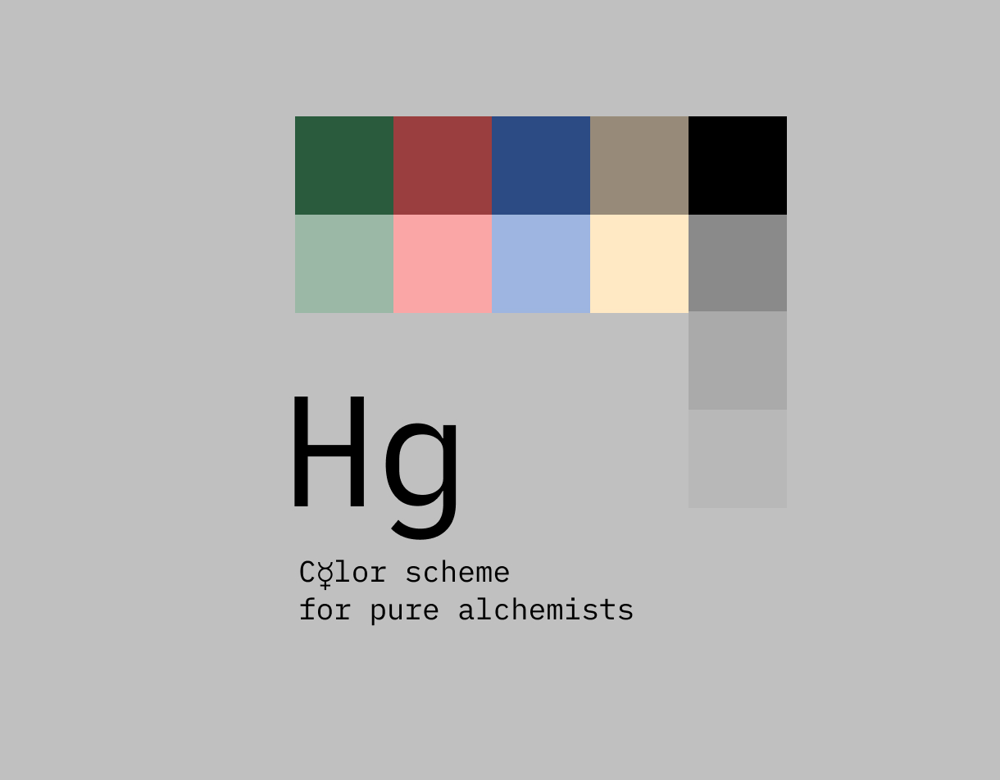
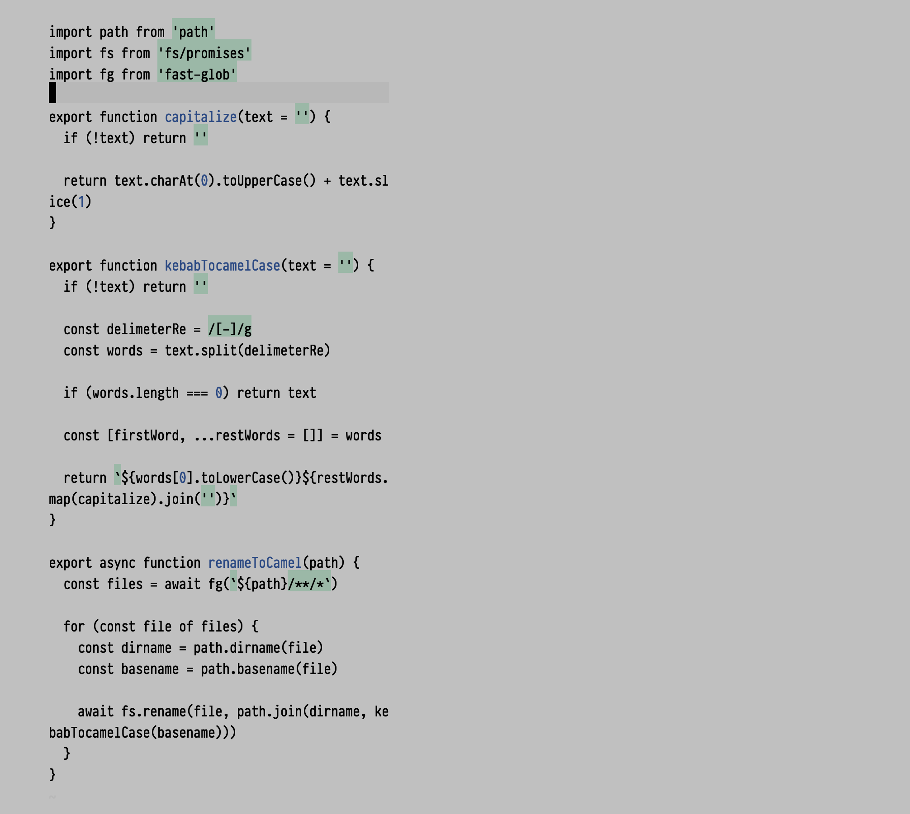
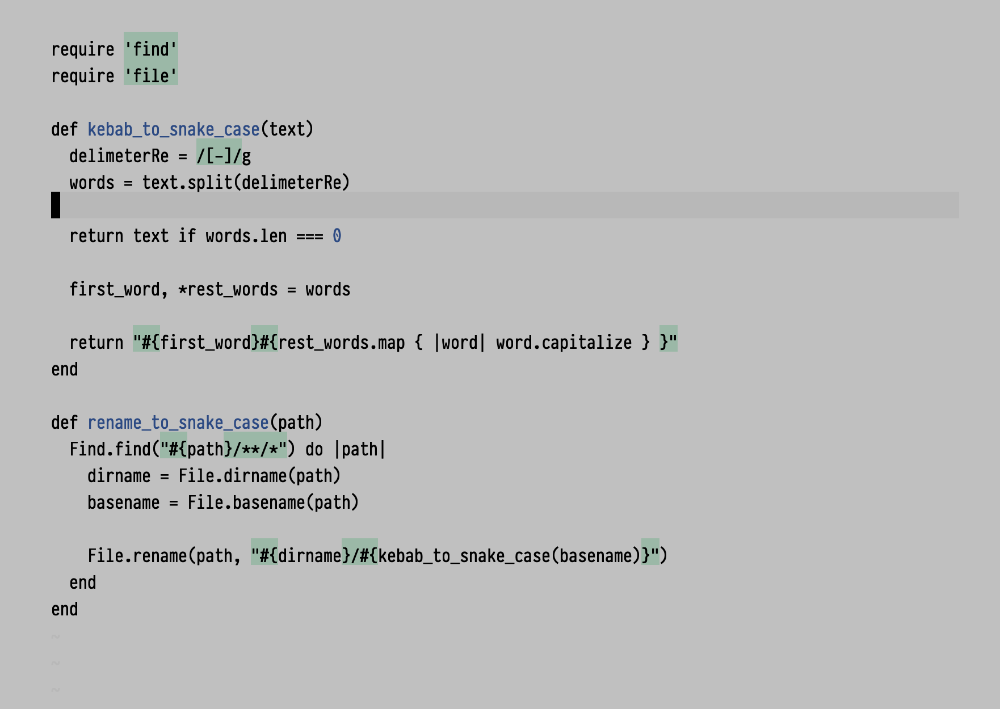

# hg.vim

<p align="center">
  
</p>

## Features

- Dimmed colors for eyes relaxing
- Design on the edge of the light and dark themes
- Minimalistic color palette
- Only important things highlight

## Install

### vim

Via `Packer` for `neovim`:

```
use { "lamartire/hg.vim" }
```

### alacritty

Just insert [`alacritty/hg.yml`](./alacritty/hg.yml) content to your 
`.config/alacritty/alacritty.yml` file.

### tmux

At this moment I'm working on `tpm` plugin, but you can install it manually,
by inserting [`tmux/hg.tmux`](./tmux/hg.tmux) content to your 
`.tmux.conf` file. Then hit `Ctrl+b-I` to reload `tmux`.

## Styleguide

All the color tokens are located in `config.yml` file. Under the hood, `hg` use
`handlebars` to pass colors to the templates. Explore `src/` directory for examples.

If you want to contribute, please use colors from `config.yml` only.

## Build

If you want to contribute or just build your own `hg` option, you should install
`ruby` and run `ruby ./scripts/build.rb`. Then, use files from the root directory.

## Preview

### Javascript



### Ruby



## Credit

Strongly inspired by [alabaster][alabaster].

[alabaster]: https://github.com/tonsky/sublime-scheme-alabaster/
