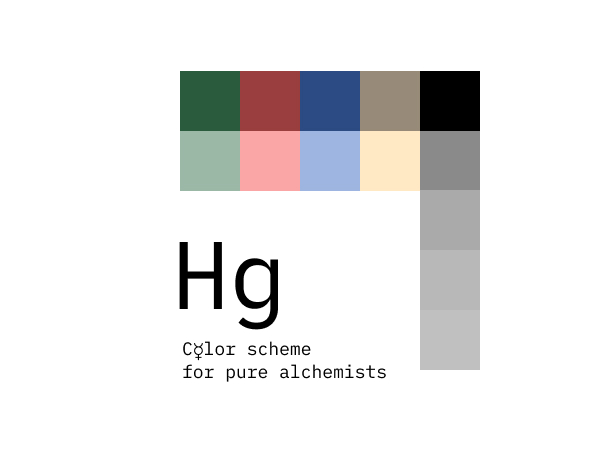

# Hg [WIP]

> C☿lor scheme for pure alchemists 

  

Alchemically light theme with minimalistic syntax highlighting.

## Color tokens

- Background – #CCCCCC
- Foreground – #000000
- String background – #91BFA3
- Number background – #95ACD6
- Built-in constants (boolean, keywords, etc.) background – #BA9BC2
- Selection background – #B8B8B8
- Search match – #FFEE00, with current match – #DBA100 
- Current search match – #FFEE00 
- Errors - #FF5C5C

## Credit

Strongly inspired by [alabaster][alabaster].

[alabaster]: https://github.com/tonsky/sublime-scheme-alabaster/
